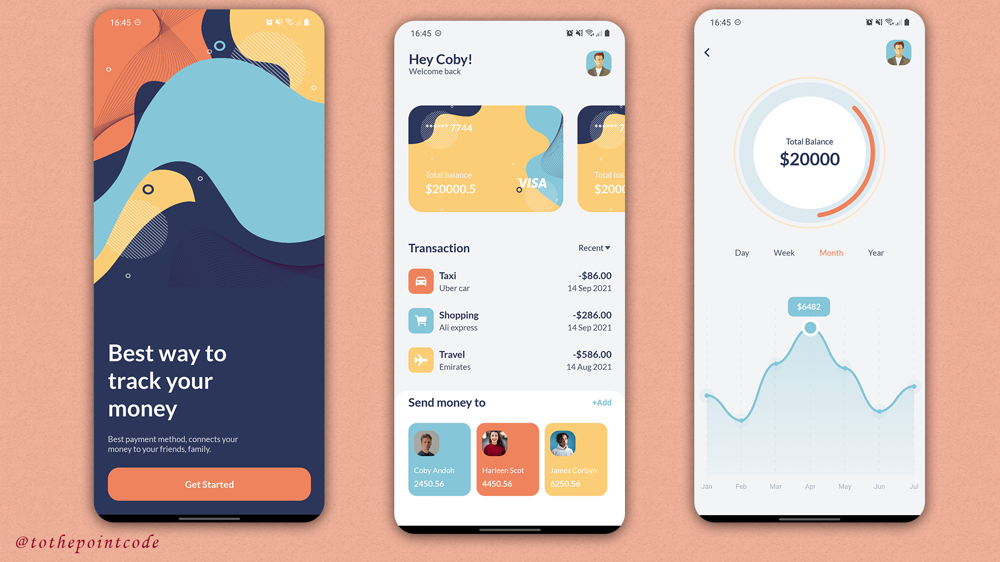

# Financial App UI

UI implementation of a financial mobile app (wallet) concept.

## Design Concept

Inspired by the wallet design concept created by [Rakib Kowshar](https://dribbble.com/shots/14392439-Wallet-App-Design).

## Screenshots

The implemented screens.

## Tools Used

- [React Native](https://reactnative.dev/)
- [Expo](https://expo.io/)
- [Typescript](https://www.typescriptlang.org/)

## Acknowledgements

- [Vector4Free](https://www.vector4free.com) - Source of background vector arts.
- [Unsplash](https://unsplash.com) - Source of Avatar images.
